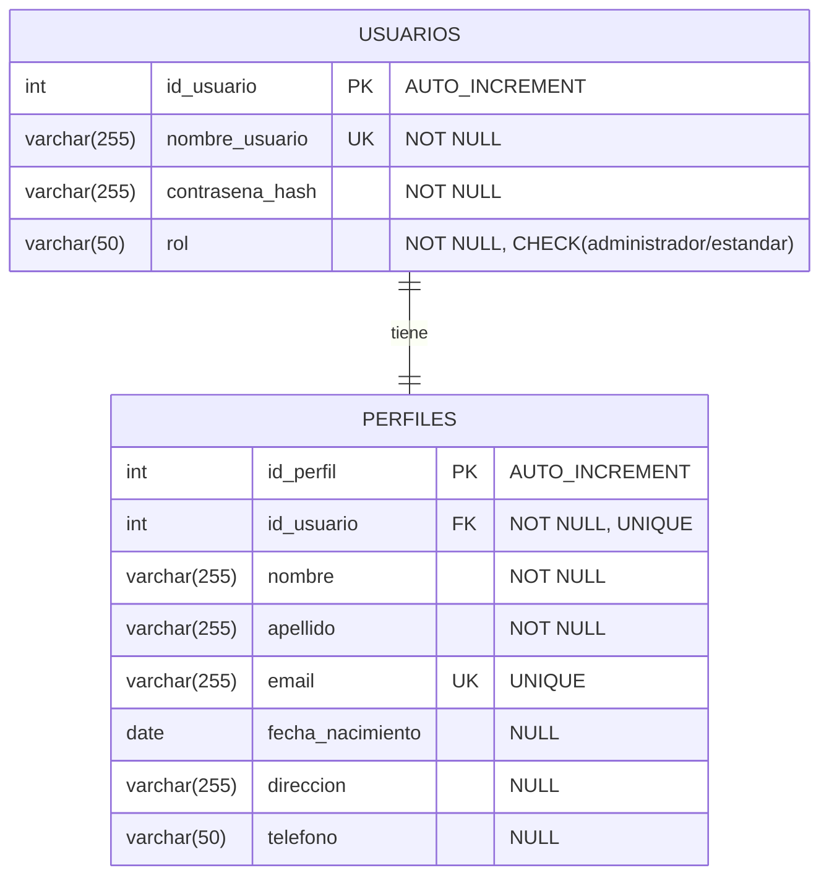

```mermaid
erDiagram
    USUARIOS {
        int id_usuario PK "AUTO_INCREMENT"
        varchar(255) nombre_usuario UK "NOT NULL"
        varchar(255) contrasena_hash "NOT NULL"
        varchar(50) rol "NOT NULL, CHECK(administrador/estandar)"
    }
    
    PERFILES {
        int id_perfil PK "AUTO_INCREMENT"
        int id_usuario FK "NOT NULL, UNIQUE"
        varchar(255) nombre "NOT NULL"
        varchar(255) apellido "NOT NULL"
        varchar(255) email UK "UNIQUE"
        date fecha_nacimiento "NULL"
        varchar(255) direccion "NULL"
        varchar(50) telefono "NULL"
    }
    
    USUARIOS ||--|| PERFILES : "tiene"
```
