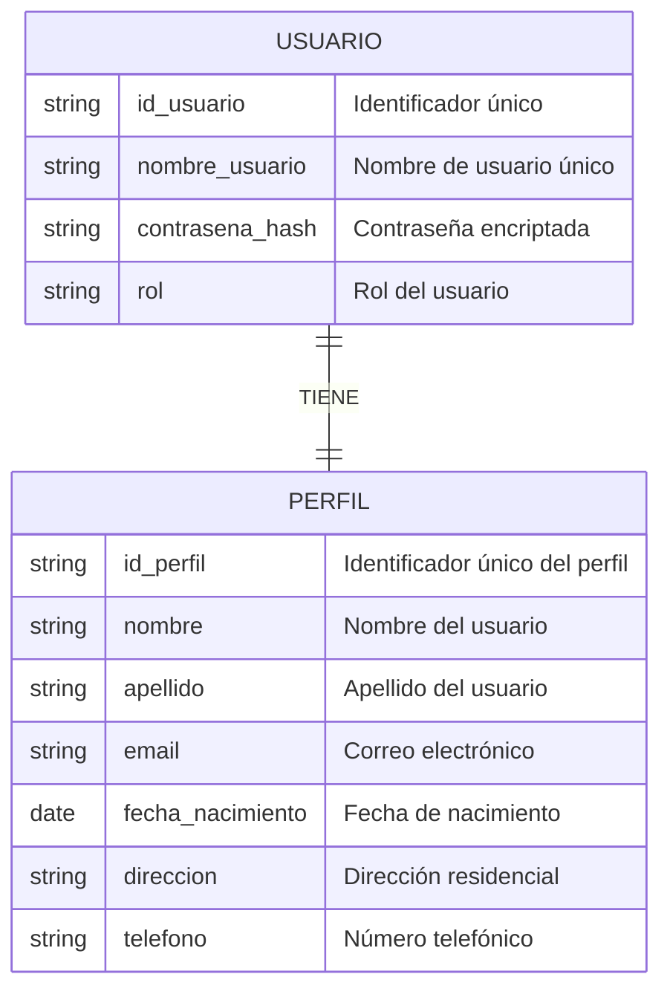

```mermaid
erDiagram
    USUARIO {
        string id_usuario "Identificador único"
        string nombre_usuario "Nombre de usuario único"
        string contrasena_hash "Contraseña encriptada"
        string rol "Rol del usuario"
    }
    
    PERFIL {
        string id_perfil "Identificador único del perfil"
        string nombre "Nombre del usuario"
        string apellido "Apellido del usuario"
        string email "Correo electrónico"
        date fecha_nacimiento "Fecha de nacimiento"
        string direccion "Dirección residencial"
        string telefono "Número telefónico"
    }
    
    USUARIO ||--|| PERFIL : TIENE
```
