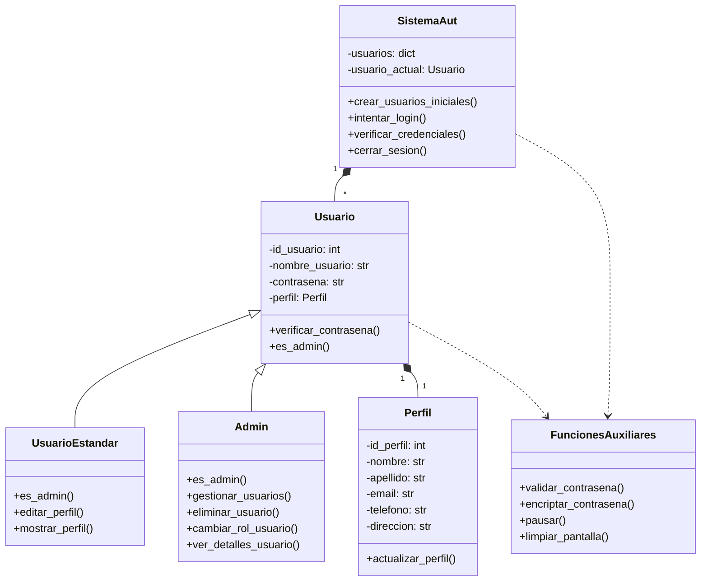

# Documentación del Diagrama de Clases

---

## 1. Descripción General

El sistema está diseñado con una arquitectura orientada a objetos que separa las responsabilidades en diferentes clases. La estructura principal se basa en la gestión de usuarios y sus perfiles, con diferentes roles y niveles de acceso.

### Descripción del Sistema

---

## Clases Principales

### `SistemaAut`

* **Descripción:** Clase principal que gestiona el sistema de autenticación y usuarios.
* **Atributos:**
    * `usuarios`: Diccionario que almacena todos los usuarios del sistema.
    * `usuario_actual`: Referencia al usuario que ha iniciado sesión.
* **Métodos principales:**
    * `crear_usuarios_iniciales()`: Crea los usuarios predeterminados del sistema.
    * `intentar_login()`: Maneja el proceso de inicio de sesión.
    * `verificar_credenciales()`: Valida las credenciales del usuario.
    * `cerrar_sesion()`: Cierra la sesión del usuario actual.

### `Usuario` (Clase Base)

* **Descripción:** Clase base abstracta para todos los tipos de usuarios.
* **Atributos:**
    * `id_usuario`: Identificador único del usuario.
    * `nombre_usuario`: Nombre de usuario para login.
    * `contrasena`: Contraseña del usuario.
    * `perfil`: Referencia al objeto `Perfil`.
* **Métodos principales:**
    * `verificar_contrasena()`: Verifica si la contraseña es correcta.
    * `es_admin()`: Método para determinar el tipo de usuario.

### `Perfil`

* **Descripción:** Clase que maneja la información personal del usuario.
* **Atributos:**
    * `id_perfil`: Identificador único del perfil.
    * `nombre`: Nombre del usuario.
    * `apellido`: Apellido del usuario.
    * `email`: Correo electrónico.
    * `telefono`: Número de teléfono.
    * `direccion`: Dirección física.
* **Métodos principales:**
    * `actualizar_perfil()`: Actualiza los datos del perfil.

---

## Clases de Usuario Específicas

### `UsuarioEstandar`

* **Descripción:** Clase que representa a un usuario estándar.
* **Hereda de:** `Usuario`.
* **Métodos específicos:**
    * `es_admin()`: Retorna False.
    * `editar_perfil()`: Permite editar el perfil del usuario.
    * `mostrar_perfil()`: Muestra la información del perfil.

### `Admin`

* **Descripción:** Clase que representa a un administrador.
* **Hereda de:** `Usuario`.
* **Métodos específicos:**
    * `es_admin()`: Retorna True.
    * `gestionar_usuarios()`: Permite gestionar usuarios del sistema.
    * `eliminar_usuario()`: Elimina usuarios del sistema.
    * `cambiar_rol_usuario()`: Cambia el rol de un usuario.
    * `ver_detalles_usuario()`: Muestra detalles de un usuario.

### `FuncionesAuxiliares`

* **Descripción:** Clase de utilidad que proporciona funciones auxiliares.
* **Métodos:**
    * `validar_contrasena()`: Valida la contraseña según políticas.
    * `encriptar_contrasena()`: Encripta la contraseña.
    * `pausar()`: Pausa la ejecución del programa.
    * `limpiar_pantalla()`: Limpia la pantalla de la consola.

---

## Relaciones entre Clases

### Composición

* `SistemaAut` contiene múltiples instancias de `Usuario` (relación 1 a muchos).
* `Usuario` contiene una instancia de `Perfil` (relación 1 a 1).

### Herencia

* `UsuarioEstandar` y `Admin` heredan de `Usuario`.

### Dependencia

* `SistemaAut` y `Usuario` dependen de `FuncionesAuxiliares` para operaciones comunes.

---

## Consideraciones de Diseño

### Separación de Responsabilidades

* La clase `SistemaAut` maneja la lógica del sistema.
* Las clases de usuario manejan la lógica de autenticación.
* La clase `Perfil` maneja la información personal.
* `FuncionesAuxiliares` centraliza funciones comunes.

### Extensibilidad

* El sistema permite agregar nuevos tipos de usuarios heredando de `Usuario`.

### Seguridad

* Control de acceso basado en roles mediante el método `es_admin()`.
* Funciones auxiliares para validación y encriptación de contraseñas.

---

## Diagrama de Clases (Mermaid) 

---

Este diagrama simplificado representa la estructura base del sistema, enfocándose en las clases principales y sus relaciones fundamentales. 
A medida que se avance en el desarrollo, se irá documentando detalles de implementación como menús y métodos más específicos.

### Notas de Diseño
- El diseño separa claramente la lógica de autenticación, los datos personales y la interfaz de usuario (menús).
- Permite extender fácilmente funcionalidades (por ejemplo, agregar validaciones, utilidades, o nuevos tipos de usuario).
- La clase `Perfil` centraliza los datos personales, facilitando su gestión y validación.