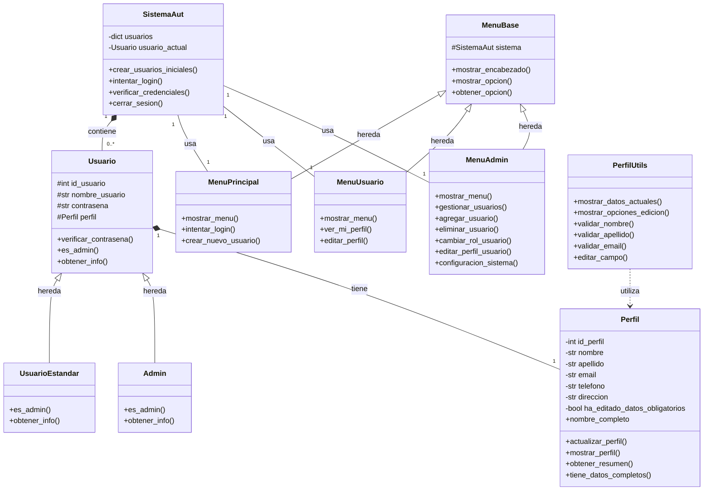

# Diagrama de Clases Actual

## Descripción General

Documentación actualizada del sistema, que está diseñado con una arquitectura orientada a objetos que separa las responsabilidades en diferentes clases. La estructura principal se basa en la gestión de usuarios y sus perfiles, con diferentes roles y niveles de acceso. 

## Diagrama Mermaid

## Descripción de Clases

### `SistemaAut`
- **Descripción:** Clase principal que gestiona el sistema de autenticación y usuarios.
- **Atributos:**
    * `usuarios`: Diccionario que almacena todos los usuarios del sistema.
    * `usuario_actual`: Referencia al usuario que ha iniciado sesión.
- **Métodos principales:**
    * `crear_usuarios_iniciales()`: Crea los usuarios predeterminados del sistema.
    * `intentar_login()`: Maneja el proceso de inicio de sesión.
    * `verificar_credenciales()`: Valida las credenciales del usuario.
    * `cerrar_sesion()`: Cierra la sesión del usuario actual.

### `Usuario` (Clase Base)
- **Descripción:** Clase base abstracta para todos los tipos de usuarios.
- **Atributos:**
    * `id_usuario`: Identificador único del usuario.
    * `nombre_usuario`: Nombre de usuario para login.
    * `contrasena`: Contraseña del usuario.
    * `perfil`: Referencia al objeto `Perfil`.
- **Métodos principales:**
    * `verificar_contrasena()`: Verifica si la contraseña es correcta.
    * `es_admin()`: Método para determinar el tipo de usuario.
    * `obtener_info()`: Devuelve información básica del usuario.

### `UsuarioEstandar`
- **Descripción:** Clase que representa a un usuario estándar del sistema.
- **Métodos principales:**
    * `es_admin()`: Retorna `False`.
    * `obtener_info()`: Devuelve información específica de usuario estándar.

### `Admin`
- **Descripción:** Clase que representa a un administrador del sistema.
- **Métodos principales:**
    * `es_admin()`: Retorna `True`.
    * `obtener_info()`: Devuelve información específica de administrador.

### `Perfil`
- **Descripción:** Clase que maneja la información personal del usuario.
- **Atributos:**
    * `id_perfil`: Identificador único del perfil.
    * `nombre`: Nombre del usuario.
    * `apellido`: Apellido del usuario.
    * `email`: Correo electrónico.
    * `telefono`: Número de teléfono.
    * `direccion`: Dirección física.
    * `ha_editado_datos_obligatorios`: Control de ediciones.
- **Métodos principales:**
    * `nombre_completo`: Propiedad que retorna el nombre completo.
    * `actualizar_perfil()`: Actualiza los datos del perfil.
    * `mostrar_perfil()`: Muestra los datos del perfil.
    * `obtener_resumen()`: Retorna un resumen del perfil.
    * `tiene_datos_completos()`: Verifica si el perfil está completo.

### `MenuBase`
- **Descripción:** Clase base para todos los menús del sistema.
- **Atributos:**
    * `sistema`: Referencia al sistema de autenticación.
- **Métodos principales:**
    * `mostrar_encabezado()`: Muestra el encabezado del menú.
    * `mostrar_opcion()`: Muestra una opción del menú.
    * `obtener_opcion()`: Obtiene la opción seleccionada.

### `MenuPrincipal`
- **Descripción:** Menú principal del sistema.
- **Métodos principales:**
    * `mostrar_menu()`: Muestra el menú principal.
    * `intentar_login()`: Maneja el inicio de sesión.
    * `crear_nuevo_usuario()`: Permite crear un nuevo usuario.

### `MenuUsuario`
- **Descripción:** Menú para usuarios estándar.
- **Métodos principales:**
    * `mostrar_menu()`: Muestra el menú de usuario.
    * `ver_mi_perfil()`: Muestra el perfil del usuario.
    * `editar_perfil()`: Permite editar el perfil.

### `MenuAdmin`
- **Descripción:** Menú para administradores.
- **Métodos principales:**
    * `mostrar_menu()`: Muestra el menú de administrador.
    * `gestionar_usuarios()`: Gestiona los usuarios del sistema.
    * `agregar_usuario()`: Agrega un nuevo usuario.
    * `eliminar_usuario()`: Elimina un usuario.
    * `cambiar_rol_usuario()`: Cambia el rol de un usuario.
    * `editar_perfil_usuario()`: Edita el perfil de un usuario.
    * `configuracion_sistema()`: Configura el sistema.

### `PerfilUtils`
- **Descripción:** Clase de utilidades para manejar perfiles.
- **Métodos principales:**
    * `mostrar_datos_actuales()`: Muestra los datos actuales.
    * `mostrar_opciones_edicion()`: Muestra opciones de edición.
    * `validar_nombre()`: Valida el nombre.
    * `validar_apellido()`: Valida el apellido.
    * `validar_email()`: Valida el email.
    * `editar_campo()`: Edita un campo específico.

## Consideraciones de Diseño

### Separación de Responsabilidades
- Cada clase tiene una responsabilidad única y bien definida
- La lógica de negocio está separada de la interfaz de usuario
- Los menús están organizados por tipo de usuario

### Extensibilidad
- El sistema permite agregar nuevos tipos de usuarios
- Los menús son extensibles y modulares
- Las utilidades están separadas para reutilización

### Seguridad
- Las contraseñas se manejan de forma segura
- Los perfiles tienen control de edición
- Los roles están claramente definidos

### Mantenibilidad
- El código está organizado en módulos lógicos
- Las clases tienen una estructura clara
