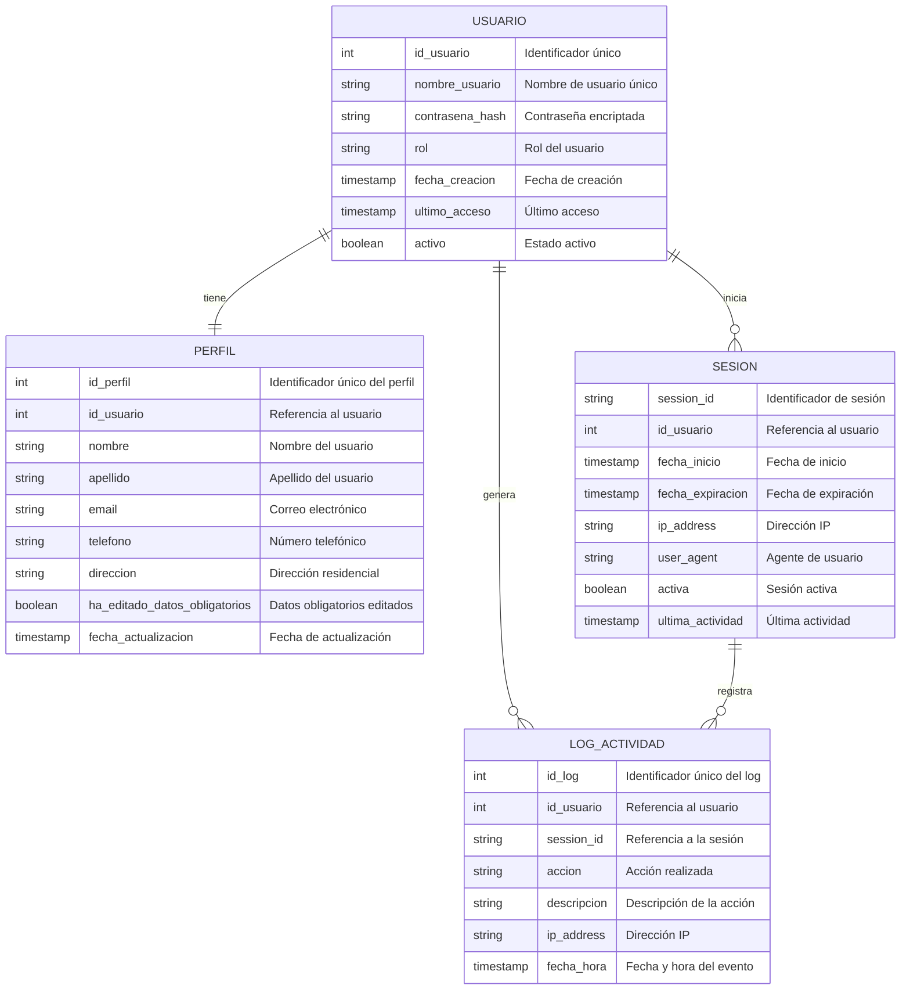

```mermaid
erDiagram
    USUARIO {
        int id_usuario "Identificador único"
        string nombre_usuario "Nombre de usuario único"
        string contrasena_hash "Contraseña encriptada"
        string rol "Rol del usuario"
        timestamp fecha_creacion "Fecha de creación"
        timestamp ultimo_acceso "Último acceso"
        boolean activo "Estado activo"
    }
    
    PERFIL {
        int id_perfil "Identificador único del perfil"
        int id_usuario "Referencia al usuario"
        string nombre "Nombre del usuario"
        string apellido "Apellido del usuario"
        string email "Correo electrónico"
        string telefono "Número telefónico"
        string direccion "Dirección residencial"
        boolean ha_editado_datos_obligatorios "Datos obligatorios editados"
        timestamp fecha_actualizacion "Fecha de actualización"
    }
    
    SESION {
        string session_id "Identificador de sesión"
        int id_usuario "Referencia al usuario"
        timestamp fecha_inicio "Fecha de inicio"
        timestamp fecha_expiracion "Fecha de expiración"
        string ip_address "Dirección IP"
        string user_agent "Agente de usuario"
        boolean activa "Sesión activa"
        timestamp ultima_actividad "Última actividad"
    }
    
    LOG_ACTIVIDAD {
        int id_log "Identificador único del log"
        int id_usuario "Referencia al usuario"
        string session_id "Referencia a la sesión"
        string accion "Acción realizada"
        string descripcion "Descripción de la acción"
        string ip_address "Dirección IP"
        timestamp fecha_hora "Fecha y hora del evento"
    }
    
    USUARIO ||--|| PERFIL : "tiene"
    USUARIO ||--o{ SESION : "inicia"
    USUARIO ||--o{ LOG_ACTIVIDAD : "genera"
    SESION ||--o{ LOG_ACTIVIDAD : "registra"    
```